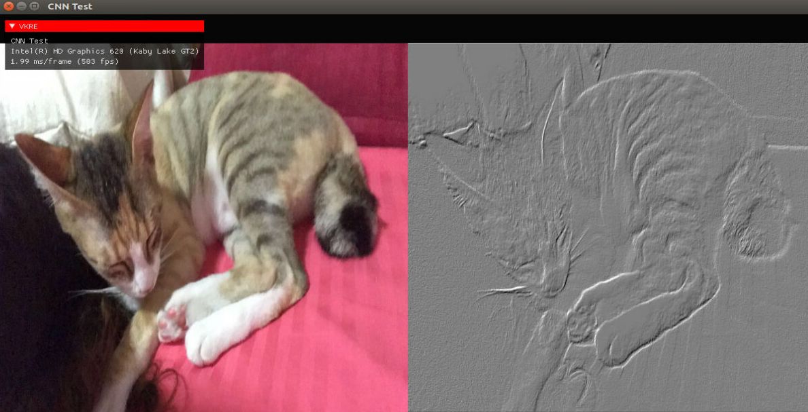

# VulkanEngine
[Vulkan(tm)](https://www.khronos.org/vulkan/) based rendering and compute engine prototype work.

This work heavily references and uses codes from [SaschaWillems'](https://github.com/SaschaWillems/Vulkan) excellent Vulkan tutorial. Also uses gli, glm, imgui and stb image loader.

Only Linux XCB is supported.

To build assuming you are in the VulkanEngine directory:
```
$ mkdir build
$ cd buile
$ cmake ..
$ make
```

